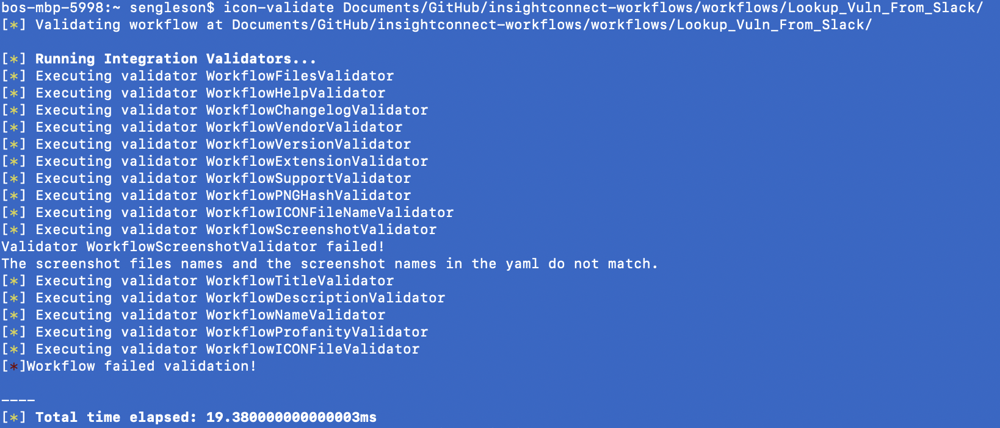

# Workflow Contributor's Guide

This page includes all the information needed to contribute an InsightConnect workflow to the Rapid7 Extension Library. For information on workflow building, please refer to the InsightConnect Help Documentation.

_Note that contributing a workflow from InsightConnect does not share any of the credentials, API keys, passwords, or other user data utilized by your Connections!_ The .icon file exported from InsightConnect only contains the workflow logic itself -- the plugins, actions, decisions, filters, etc.

There are three steps to contributing a workflow:

1. **Build and test your workflow**. Read the brief Workflow Builder Checklist in Step 1 below to make sure your workflow step names and descriptions are standard. Be sure to include a Final Report artifact that summarizes the outcome of your workflow. Test your workflow (in production if possible!) and take screenshots of the successful job and Final Report artifact.
2. **Prepare your workflow bundle**. Write your workflow description and associated documentation for the Rapid7 Extension Library listing. Put your screenshots in the bundle. Test it.
3. **Create a PR**.

Once you have completed an InsightConnect workflow, it will likely take you under an hour to test it, bundle it, and contribute it.


## Step 1: Build and Test

### Workflow Builder Checklist

To keep workflows consistent and high quality, please make sure your workflow:
* is named descriptively
* includes a description
* step names follow [Title of Articles] format
* includes a `Final Report` artifact that summarizes the outcome of the workflow

### Test It

While you may test your workflow using InsightConnect's built-in test feature, it's generally advisable to test your workflow in real-world conditions when possible. There's no test like activating and triggering the workflow in production.

## Step 2: Build Your Workflow Bundle

Workflows in InsightConnect help automate activities ranging from simple tasks to complex processes. The contents of your workflow bundle help us present your workflow the right way, with all the information necessary for another to learn, import, and automate all on their own. 

The bundle includes:
* The .icon workflow file
* A markdown file, `help.md`, that provides the details for the workflow listing on the Rapid7 Extension Library
* A specification file, `workflow.spec.yaml` with indexing information for the Extension Library
* The standard `extension.png` file
* A `screenshots` folder
* A screenshot of the workflow in the Builder view in the screenshots folder
* A screenshot of a successful job in the screenshots folder
* A screenshot of the Final Report artifact after a successful execution in the screenshots folder

Workflow bundles are organized according to the following directory structure:
```
└── workflows
    └── Name_Of_Workflow
        ├── Name_of_Workflow.icon
        ├── help.md
        ├── workflow.spec.yaml
        └── screenshots
            ├── artifact1.png
            ├── job1.png
            └── workflow1.png
```

### Export It

Activate your workflow in InsightConnect. Navigate to the Active Workflows page, click the menu (...) icon for the workflow you want to contribute, and select Export. InsightConnect will save your workflow .icon file to your Downloads folder. Note that .icon files do *not* contain *any* of the credentials used in your implementation of the workflow! The .icon file merely contains the workflow plugins, actions, and logic -- not the connection details.

The default export will name the file exactly as the workflow is named – edit the name of the .icon file to replace spaces with underscores and capitalize the first letter of each word. You may shorten keywords for brevity's sake. Just try to keep the file name as close to the original as possible. For example, the .icon file for a workflow named _Lookup Vuln from Slack_ would be _Lookup_Vuln_From_Slack.icon_.

### Screenshot It

Take PNG screenshots of:
* the workflow in builder view
* the successful workflow job
* the Final Report artifact from the successful workflow job

If you can't fit any of these items entirely into one screenshot, then don't worry! It's more important that the text is legible than that you capture the entire thing in one picture. If it would be helpful for a user of the Extension Library to see multiple screenshots of the workflow, the job, or the artifact, then feel free to include multiple screenshots. Simply title them `workflow1.png`, `artifact1.png`, `artifact2.png`, `job1.png`...

### Bundle It

Download and unzip the [My_Cool_Workflow archive]. Inside, you will find all the files you'll need to complete your bundle.

* Rename the folder so it matches the name of your workflow .icon file, excluding the .icon extension
* Move or copy your workflow, job, and artifact screenshots into the screenshots directory inside your workflow directory

### Write Your Help File

The help markdown file – `help.md` – is the file that provides all the details listed on the Rapid7 Extension Library. For reference, please find a few example workflow listings below:

* https://extensions.rapid7.com/extension/Lookup_Vuln_From_Slack
* https://extensions.rapid7.com/extension/Spearphishing_Remediation_with_Mimecast
* https://extensions.rapid7.com/extension/Spearphishing_Remediation_with_Office_365

Open the template `help.md` file from the `My_Cool_Workflow` zip and make the following updates:

1. Revise the **Description** to include a brief summary of the workflow. This should not exceed 5 sentences. The Description in the help.md file populates the Overview in the Extension Library listing.
2. Enter as many **Key Features** as necessary – these should describe the value provided by the workflow to the end user.
3. Enter any **Requirements** for the workflow to execute. This section should include any credentials, API keys, or other essential items for connections to plugins utilized by the workflow.
4. Enter your **Setup** information. This may include updating certain variables in the workflow or configuring connections.
5. Include the **Technical Details** of each plugin utilized by the workflow.
6. Provide any **Troubleshooting** recommendations. This is uncommon for workflows, but if certain components are prone to failure then identify them here.
7. Add to the **Version History** if you are updating an existing workflow. Workflow versions start with 1.0.0. Minor changes to the workflow (updated plugins, minor changes in workflow logic) may be reflected with minor updates (eg, 1.1.0, 1.2.0, etc.). Major changes to the workflow (added capabilities, entirely new workflow logic, completely changed plugins, etc.) may be reflected with major updates (eg, 1.0.0, 2.0.0, etc.).
8. Include any **References** to integration details (white papers, tech sheets, etc.),vendors, or open source solutions utilized in the workflow.

When you're done, save the `help.md` file to the main workflow directory.

### Create Your Workflow Spec

Don't worry, the `workflow.spec.yaml` file is less uplift than the help.md file was! Open the `workflow.spec.yaml` file from the `My_Cool_Workflow` zip to find a template. Make the following updates:

1. Match the `name` variable with your workflow directory title (eg, `My_Cool_Workflow`)
2. Match the `title` variable with the name of the workflow in InsightConnect (eg, My Cool Workflow, Lookup Vulnerability from Slack)
3. Write a brief (2-sentence) `description`. This will oftentimes match the description written for the workflow in InsightConnect workflow settings. This description will show on the preview pane of the Extension Library.
4. Enter any `use_cases` tags from the Extension Library that apply to your workflow. Use case tags use snake case (eg, vulnerability_management, threat_detection_and_response) and must match the use cases available on the Extension Library.
5. Enter any `keyword` tags from the Extension Library that apply to your workflow. Keyword tags also use snake case and must match the tags available on the Extension Library.
6. Update the screenshot names to match the names of the screenshot files in your screenshots directory
7. Update the screenshot titles as necessary

When you're done, save the `workflow.spec.yaml` file to your main workflow directory.

Your workflow bundle is now prepared! Just one more test and then we'll contribute it via GitHub.

### Test Your Workflow Bundle

The InsightConnect engineering team has built command-line validation tools that will help identify potential issues in the workflow bundle prior to submission. This helps identify minor inconsistencies, such as missing files, grammatical errors, capitalization mistakes, mismatched names across files, etc.

Use the following commands to install and run the InsightConnect Workflow Validator tool:

```
$ pip install insightconnect-integrations-validators
$ icon-validate <workflow_dir>
```

The output of the tool will identify any errors:



*Note: The InsightConnect Workflow Validator tool requires python3*

## Step 3: Submit a Pull Request

Once your workflow bundle passes the validation test, you're all set to submit a pull request! Please remember our *Dos* and *Don'ts*:

* *Do* create a topic branch to work on. This helps ensure users are aware of commits on the branch being considered for merge, allows for a location for more commits to be offered without mingling with other contributor changes, and allows contributors to make progress while a PR is still being reviewed.
* *Do* license your code as MIT.
* *Do* follow the [50/72 rule] for Git commit messages.
* *Do* write "WIP" on your PR and/or open a draft PR if submitting unfinished code.
* *Do* target your pull request to the master branch.
* *Do* specify a descriptive title to make searching for your pull request easier e.g. "Okta: New user suspension workflow".
* *Do* reference associated issues in your pull request description.
* *Don't* leave your pull request description blank.
* *Don't* abandon your pull request. Being responsive helps us land your code faster.
* *Don't* include more than one workflow per pull request.

Our team strives to review and approve or provide feedback on workflow contributions as quickly as we can. Once we've approved your workflow bundle, it will be available on Rapid7's Extension Library within a few days!

*THANK YOU FOR CONTRIBUTING!!!*

[Title of Articles]:http://grammar.yourdictionary.com/capitalization/rules-for-capitalization-in-titles.html
[My_Cool_Workflow archive]:./My_Cool_Workflow.zip
[50/72 rule]:https://stackoverflow.com/questions/2290016/git-commit-messages-50-72-formatting
