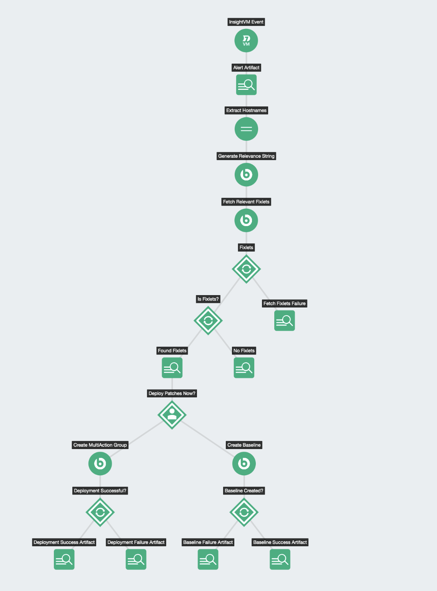
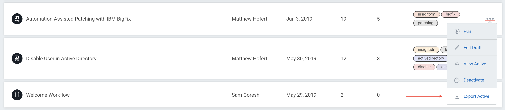

# InsightConnect Workflows

A repository for sharing InsightConnect workflows. Find existing automations as well as share yours!

If you have questions, reach out to us at `IntegrationAlliance@rapid7.com`.



### Table of Contents

1. [Getting Started](#getting-started)
2. [Contributing](#contributing)

### Getting Started

See the documentation on building workflows in [InsightConnect](https://insightconnect.help.rapid7.com/docs/).

1. Build your workflow in InsightConnect
2. Export the intended workflow from the Workflows page

3. Create a PR of the workflow including screenshots demonstrating its use

Organize using the following directory structure:

```
└── workflows
    └── Basic_Domain_Enrichment_Report
        ├── Basic_Domain_Enrichment_Report.kom
        └── screenshots
            ├── artifact1.png
            ├── artifact2.png
            ├── workflow1.png
            └── workflow2.png
├── snippets
    └── ...
```

### Contributing

See our [contributing guide](./CONTRIBUTING.md).
